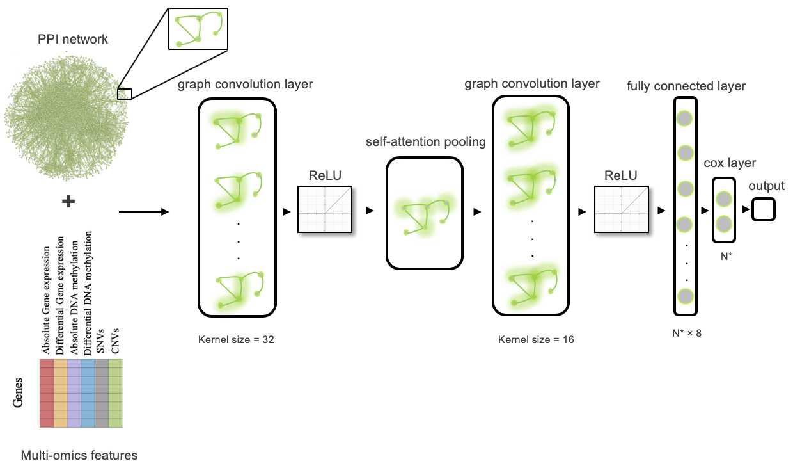
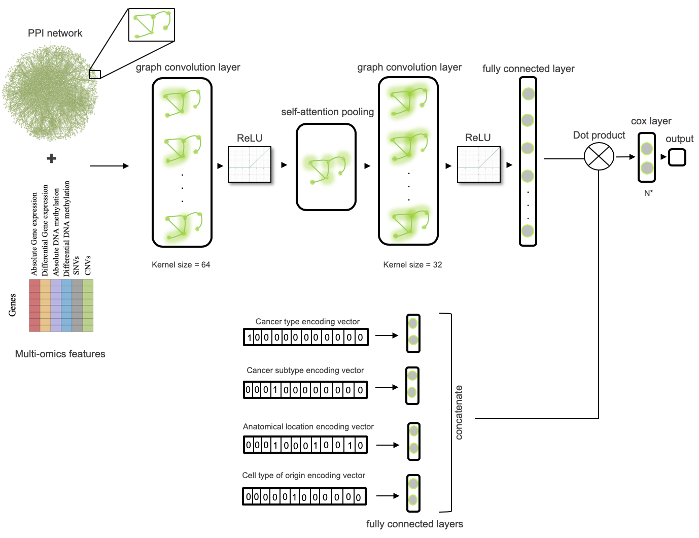

# DeepMOCCA - Deep Multi Omics CanCer Analysis

## Datasets

* All multi-omics data for the 33 cancer types (i.e. gene expression, DNA methylation, copy number variation (CNV), single nucleotide variation (SNV) and clinical data) have been downloded from [The Cancer Genome Atlas (TCGA)](http://cancergenome.nih.gov) via their [Data Transfer Tool Client](https://gdc.cancer.gov/access-data/gdc-data-transfer-tool)

* The protein-protein interactions network for human from [STRING](https://string-db.org/cgi/download.pl?sessionId=VKCYtvc7YJch&species_text=Homo+sapiens)

## Dependencies

To install python dependencies run: `pip install -r requirements.txt`

## Prediction of cancer patients survival time workflow

- Download all the provided files from this repository
```
git clone https://github.com/bio-ontology-research-group/Cancer_SurvivalPrediction.git
```
## 1- Graph neural networks -based prediction of survival time from personal omics datasets



## 2- Graph neural networks predict survival time across subtypes


We developed a subtypes-based model that integrates information from encoded subgroups of cancer subtypes, anatomical parts, and the cell types of origin besides the cancer types and given different multi-omics data for cancer patients fall within these subgroups.

- In the terminal, run:

```
chmod +x Combined_model.sh
./Combined_model.sh -ae AbsgeneExpressionDirectory -de DiffgeneExpressionDirectory -am AbsdnaMethylationDirectory -dm DiffdnaMethylationDirectory -cnv CnvDirectory -snv SnvDirectory -ct CancerType -al AnatomicalLocation
```
where the following are mandatory arguments:
```
     -ae Absulote gene expression directory
     -de Differentinal gene expression directory
     -am Absulote DNA meythlation directory
     -dm Differentinal DNA meythlation directory
     -cnv CNVs directory
     -snv SNVs directory
     -ct Specify number correspond to the type of cancer using the following:
	   1 -- Adrenocortical Carcinoma
	   2 -- Bladder Urothelial Carcinoma
	   3 -- Breast Invasive Carcinoma
	   4 -- Cervical Squamous Cell Carcinoma and Endocervical Adenocarcinoma
	   5 -- Cholangiocarcinoma
	   6 -- Colon Adenocarcinoma
	   7 -- Lymphoid Neoplasm Diffuse Large B-cell Lymphoma
	   8 -- Esophageal Carcinoma
	   9 -- Glioblastoma Multiforme
	   10 -- Head and Neck Squamous Cell Carcinoma
	   11 -- Kidney Chromophobe
	   12 -- Kidney Renal Clear Cell Carcinoma
	   13 -- Kidney Renal Papillary Cell Carcinoma
	   14 -- Acute Myeloid Leukemia
	   15 -- Brain Lower Grade Glioma
	   16 -- Liver Hepatocellular Carcinoma
	   17 -- Lung Adenocarcinoma
	   18 -- Lung Squamous Cell Carcinoma
	   19 -- Mesothelioma
	   20 -- Ovarian Serous Cystadenocarcinoma
	   21 -- Pancreatic Adenocarcinoma
	   22 -- Pheochromocytoma and Paraganglioma
	   23 -- Prostate Adenocarcinoma
	   24 -- Rectum Adenocarcinoma
	   25 -- Sarcoma
	   26 -- Skin Cutaneous Melanoma
	   27 -- Stomach Adenocarcinoma
	   28 -- Testicular Germ Cell Tumors
	   29 -- Thyroid Carcinoma
	   30 -- Thymoma
	   31 -- Uterine Corpus Endometrial Carcinoma
	   32 -- Uterine Carcinosarcoma
	   33 -- Uveal Melanoma
     -al Specify number correspond to the anatomical parts that cancer using the following:
	   1 -- Adrenal gland
	   2 -- Base of tongue
	   3 -- Bladder
	   4 -- Bones, joints and articular cartilage of limbs
	   5 -- Bones, joints and articular cartilage of other and unspecified sites
	   6 -- Brain
	   7 -- Breast
	   8 -- Bronchus and lung
	   9 -- Cervix uteri
	   10 -- Colon
	   11 -- Connective, subcutaneous and other soft tissues
	   12 -- Corpus uteri
	   13 -- Esophagus
	   14 -- Eye and adnexa
	   15 -- Floor of mouth
	   16 -- Gallbladder
	   17 -- Gum
	   18 -- Heart, mediastinum, and pleura
	   19 -- Hematopoietic and reticuloendothelial systems
	   20 -- Hypopharynx
	   21 -- Kidney
	   22 -- Larynx
	   23 -- Lip
	   24 -- Liver and intrahepatic bile ducts
	   25 -- Lymph nodes
	   26 -- Meninges
	   27 -- Oropharynx
	   28 -- Other and ill-defined sites
	   29 -- Other and ill-defined sites in lip, oral cavity and pharynx
	   30 -- Other and unspecified major salivary glands
	   31 -- Other and unspecified male genital organs
	   32 -- Other and unspecified parts of biliary tract
	   33 -- Other and unspecified parts of mouth
	   34 -- Other and unspecified parts of tongue
	   35 -- Other endocrine glands and related structures
	   36 -- Ovary
	   37 -- Palate
	   38 -- Pancreas
	   39 -- Peripheral nerves and autonomic nervous system
	   40 -- Prostate gland
	   41 -- Rectosigmoid junction
	   42 -- Rectum
	   43 -- Retroperitoneum and peritoneum
	   44 -- Skin
	   45 -- Small intestine
	   46 -- Spinal cord, cranial nerves, and other parts of central nervous system
	   47 -- Stomach
	   48 -- Testis
	   49 -- Thymus
	   50 -- Thyroid gland
	   51 -- Tonsil
	   52 -- Uterus, NOS
```
### Output
The model will output:
- A file contains average attention-based ranks for the genes over all samples for the selected cancer type.
- A file contains the time to live for all samples for the selected cancer type.

## Final notes

For any comments or help needed with how to run the scripts, please send an email to: sara.althubaiti@kaust.edu.sa
